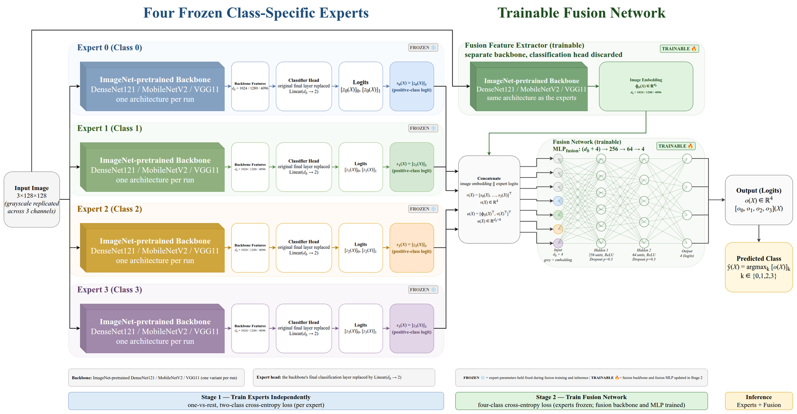

<div align="center">

# 🦋 Explainable Thyroid Scintigraphy

### A class-specific **Mixture-of-Experts** framework with **GAN-based augmentation**<br>for four-class [<sup>99m</sup>Tc]Tc-pertechnetate thyroid scintigraphy classification

<p>


</p>

<sub>Source code accompanying the manuscript · 🔗 <a href="https://elmirayazdani.github.io/thyroid-scintigraphy-xai/">Project page</a></sub>

</div>

---

<div align="center">

<br>
<sub><b>The proposed framework.</b> Four frozen class-specific experts each emit a positive-class logit; a trainable fusion network combines those logits with its own image embedding to produce the final four-class prediction.</sub>
</div>

---

## 📋 At a glance

| | |
|---|---|
| 🎯 **Task** | Four-class classification of planar thyroid scintigraphy |
| 🏥 **Data** | 2,373 real images from **5 nuclear medicine centers** → 3,526 after GAN balancing |
| 🧠 **Frameworks** | Baseline CNN · Binary granularity analysis · **Mixture-of-Experts** |
| 🔬 **Backbones** | DenseNet121 · EfficientNetB0 · MobileNetV2 · ResNet18 · VGG11 (ImageNet-pretrained) |
| 🎲 **Protocol** | Stratified 5-fold CV, seed 42, **real-only validation** |
| 👁️ **Interpretability** | Grad-CAM + per-expert response analysis |

> [!IMPORTANT]
> **This repository contains code only.** Patient images, trained checkpoints, generated figures,
> metric tables and run logs are deliberately excluded. Every script writes its own artifacts
> into a self-contained output directory when it is run.

---

## 🗂️ Repository layout

| Path | Stage | Purpose |
|---|:---:|---|
| 🧼 [`01_preprocessing/`](01_preprocessing) | 1 | Image enhancement: SwinIR denoising → NAFNet deblurring → CLAHE |
| 🎨 [`02_gan_augmentation/`](02_gan_augmentation) | 2 | Class-conditional DCGAN that synthesises training images to balance the four groups |
| 🔀 [`make_gan_augmented_5fold.py`](make_gan_augmented_5fold.py) | 2 | Builds the stratified 5-fold split consumed by every experiment |
| 🧱 [`03_baseline_cnn/`](03_baseline_cnn) | 3 | Baseline framework — five pretrained CNNs, four-class task |
| ⚖️ [`04_binary_classification/`](04_binary_classification) | 4 | Classification-granularity analysis — tumoral vs. non-tumoral |
| 🧩 [`05_mixture_of_experts/`](05_mixture_of_experts) | 5 | Proposed MoE framework — four one-vs-rest experts + trainable fusion network |

Each stage directory carries its **own `README.md`** with the exact commands, the arguments that
matter, and the artifacts that run produces.

---

## 🧬 Diagnostic groups and label mapping

The source annotations use eight raw diagnostic labels, collapsed into the four groups used
throughout the study. The mapping is identical in every script (`LABEL_GROUP_MAP`) and must not
be changed — the GAN, the fold split and all models depend on it.

| Raw label(s) | Group | Diagnosis | Real images |
|:---:|:---:|---|---:|
| 1, 3 | **1** | Diffuse goiter | 691 |
| 2, 5, 6 | **2** | Tumoral disease | 922 |
| 4 | **3** | Thyroiditis | 423 |
| 7, 8 | **4** | Normal scintigraphy | 337 |
| | | **Total** | **2,373** |

The binary experiment collapses these further (`BINARY_GROUP_MAP`): group 2 → *Tumoral* (1);
groups 1, 3 and 4 → *Non-Tumoral* (0).

---

## 🔄 Pipeline

```
 raw scintigraphy images (DICOM → PNG, quality-screened)
        │
        │  01_preprocessing/preprocessor_exp.py
        ▼
 cf_dataset_preprocessed_split/          128×128 enhanced images, train/test split
        │
        │  02_gan_augmentation/train_gan.py
        │  02_gan_augmentation/generate_augmented_dataset.py
        ▼
 cf_dataset_preprocessed_gan_augmented/  real + synthetic training images
        │
        │  make_gan_augmented_5fold.py
        ▼
 cf_dataset_preprocessed_gan_augmented_5fold/   fold_1..fold_5 × {train,val}.json
        │
        ├──► 03_baseline_cnn/          four-class baseline (5 architectures)
        ├──► 04_binary_classification/ tumoral vs. non-tumoral
        └──► 05_mixture_of_experts/    MoE (3 backbones)
```

Two properties of the split are enforced by **assertions in the code** rather than by
convention, and they govern how the reported numbers should be read:

- ✅ **Validation folds contain real images only.** Synthetic images are added to every training
  fold and never appear in validation. Each training script re-checks this at load time and
  aborts if a `source != "real"` row is found in a validation fold.
- 🔒 **The held-out test split is never touched** by the GAN, by the fold builder, or by any
  training script in this repository.

---

## 📦 Expected data layout

The dataset is not distributed here. The scripts expect these directories at the repository
root, or to be pointed at with `--fold-root` / `--image-root` / `--data-root`.

<details>
<summary><b>Show the expected directory tree</b></summary>

```
cf_dataset_preprocessed_split/
  train/images/*.png
  train/train_labels.csv          image_file,label,center,age,sex
  test/images/*.png
  test/test_labels.csv

cf_dataset_preprocessed_gan_augmented/      ← written by stage 2
  train/images/*.png                        real + GAN_g{group}_*.png synthetic
  train/train_labels.csv                    adds 'group' and 'source' columns
  test/  (unchanged copy of the real test split)
  augmentation_summary.json

cf_dataset_preprocessed_gan_augmented_5fold/   ← written by make_gan_augmented_5fold.py
  fold_1/{train,val}.json
  ...
  fold_5/{train,val}.json
  metadata.json
```

</details>

Stages 3–5 need only the last two directories. If you have received them ready-made, stages 1
and 2 can be skipped entirely.

---

## ⚙️ Environment

```bash
python -m venv .venv
source .venv/bin/activate
pip install -r requirements.txt
```

Python 3.11 with PyTorch and torchvision (CUDA build recommended). `requirements.txt` covers
stages 2–5; stage 1 installs its own dependencies — see
[`01_preprocessing/README.md`](01_preprocessing/README.md).

The experiments reported in the manuscript were run on a single **NVIDIA GeForce RTX 4090**
(24 GB VRAM, 32 GB system RAM). The training scripts fall back to CPU automatically, but a full
five-fold run is impractical without a GPU.

> Every script sets `seed = 42` and enables deterministic cuDNN. The fold assignment is fixed by
> the same seed, so all frameworks are trained and evaluated on identical partitions.

---

## ▶️ Running the experiments

Each stage runs from inside its own directory; the default paths are relative to it. Every
training script accepts **`--smoke-test`**, which shortens the run to two epochs and redirects
output to a `*_smoketest` directory — use it first to confirm the data paths resolve before
committing to a full run.

```bash
# 🧱 Stage 3 — four-class baseline (5 architectures × 5 folds × 100 epochs)
cd 03_baseline_cnn
python classification_pretrained_replication_5fold_gan_augmented.py --smoke-test --verbose
python classification_pretrained_replication_5fold_gan_augmented.py --log-every 10 --verbose
python make_final_5fold_mean_plots.py --config final_5fold_mean_plot_config.json

# ⚖️ Stage 4 — binary granularity analysis
cd ../04_binary_classification
python classification_pretrained_replication_5fold_gan_augmented_binary.py --log-every 10 --verbose
python make_pretrained_gan_binary_5fold_mean_plots.py --config pretrained_gan_binary_mean_plot_config.json

# 🧩 Stage 5 — Mixture of Experts (one run per backbone)
cd ../05_mixture_of_experts
python moe_cnn_fusion.py --backbone DenseNet121 --output-dir moe_cnn_fusion_densenet121_5fold_outputs
python moe_cnn_fusion.py --backbone MobileNetV2 --output-dir moe_cnn_fusion_mobilenetv2_5fold_outputs
python moe_cnn_fusion.py --backbone VGG11       --output-dir moe_cnn_fusion_vgg11_5fold_outputs
python build_backbone_comparison.py
```

⏱️ A full baseline run (five architectures, five folds, 100 epochs each) takes on the order of a
couple of hours on a recent consumer GPU. The three MoE runs are the most expensive part of the
study, since each trains four experts plus a fusion network per fold.

---

## 🎛️ Shared training configuration

Settings common to stages 3–5. Framework-specific values are in the stage READMEs.

| Setting | Value |
|---|---|
| Input size | 128 × 128 |
| Input channels | grayscale replicated across 3 channels |
| Normalisation | fixed ImageNet mean/std (`[0.485, 0.456, 0.406]` / `[0.229, 0.224, 0.225]`) |
| Backbone weights | torchvision `IMAGENET1K_V1` |
| Optimiser | AdamW, weight decay 1 × 10⁻⁴ |
| Loss | cross-entropy, no class weighting |
| Cross-validation | stratified 5-fold, seed 42, real-only validation |
| Checkpoint criterion | highest validation accuracy within each fold |
| Training augmentation | random horizontal flip (p = 0.5), random rotation ± 10° |
| Validation augmentation | none |

📊 Reported metrics per fold: accuracy, macro/micro precision, recall and F1, Cohen's κ, MCC,
NPV, PPV, and one-vs-rest ROC-AUC (macro, micro, weighted). Fold-level values are aggregated
into mean ± standard deviation across the five folds.

---

## 📤 Output of a training run

<details>
<summary><b>Show the artifact tree each run produces</b></summary>

```
<output-dir>/
  run_config.json          every resolved argument, device, versions, fold sizes
  fold_data_summary.csv    per-fold row counts and class distribution
  checkpoints/<model>/     best-per-fold and best-overall weights
  histories/<model>/       per-epoch loss / accuracy / learning rate
  predictions/<model>/     per-image true label, prediction and class probabilities
  reports/<model>/         per-fold sklearn classification reports
  metrics/                 per-fold metrics with mean and std, cross-model summary
  figures/<model>/         learning curves, confusion matrices, ROC curves, Grad-CAM
```

</details>

`run_config.json` and `predictions/` together are enough to recompute every number and every
figure in the manuscript **without retraining**.

---

## ⚠️ A note on VGG11

VGG11 has no batch normalisation and reproducibly collapses to a single-class solution under
AdamW at a learning rate of 1 × 10⁻³ on this dataset. It is therefore trained at 1 × 10⁻⁴ with
gradient-norm clipping at 2.0, applied **to VGG11 only** (`--vgg11-learning-rate`,
`--vgg11-grad-clip`). The four batch-normalised architectures keep the common 1 × 10⁻³ rate so
that they remain directly comparable across experiments. The same treatment is applied to the
VGG11 backbone in the MoE framework (`BACKBONE_TRAIN_CFG` in `moe_cnn_fusion.py`).

---

## 🔁 Relation to the working repository

The scripts are copied verbatim from the working research tree; no training logic, default, or
hyperparameter has been altered. Three adjustments were made for this release, and nothing else
was touched:

1. Experiment directories were renamed to the numbered, space-free names above.
2. Consequently, the two directory paths recorded in
   `04_binary_classification/pretrained_gan_binary_mean_plot_config.json` were updated to the new
   directory name.
3. In `01_preprocessing/preprocessor_exp.py`, the `from __future__ import annotations` statement
   was moved to the top of the file. Cell-by-cell execution in a notebook is insensitive to its
   position, but the exported `.py` file raised a `SyntaxError` on import, since Python requires
   that statement to precede all other code. The move is purely positional; no other line was
   changed.

Of the 18 source and configuration files, the 16 not named above are byte-for-byte identical to
the working tree.

`04_binary_classification/make_binary_extra_plots.py` additionally produces a cross-experiment
comparison against a from-scratch binary reference run that is outside the scope of this
release; see that stage's README for the arguments involved.

---

## 📖 Citation

> Yazdani E, Nesari M, Emami F, Karamzade-Ziarati N, Bagheri S, Vosoughi Z, Vosoughi H,
> Kheradpisheh SR. *An Explainable Deep Learning Medical Mixture-of-Experts Framework with
> GAN-Based Data Augmentation for Four-Class Classification of Thyroid Disease Using
> [<sup>99m</sup>Tc]Tc-Pertechnetate Scintigraphy: A Multicenter Study.*

<div align="center">
<sub>🔗 <a href="https://elmirayazdani.github.io/thyroid-scintigraphy-xai/">elmirayazdani.github.io/thyroid-scintigraphy-xai</a></sub>
</div>
